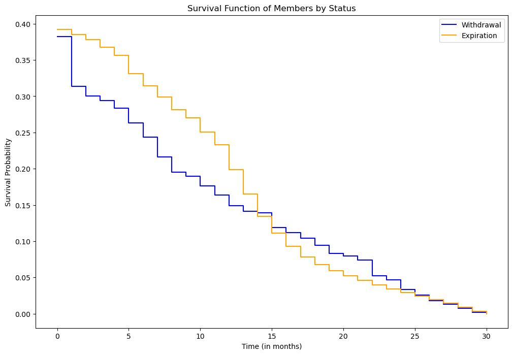
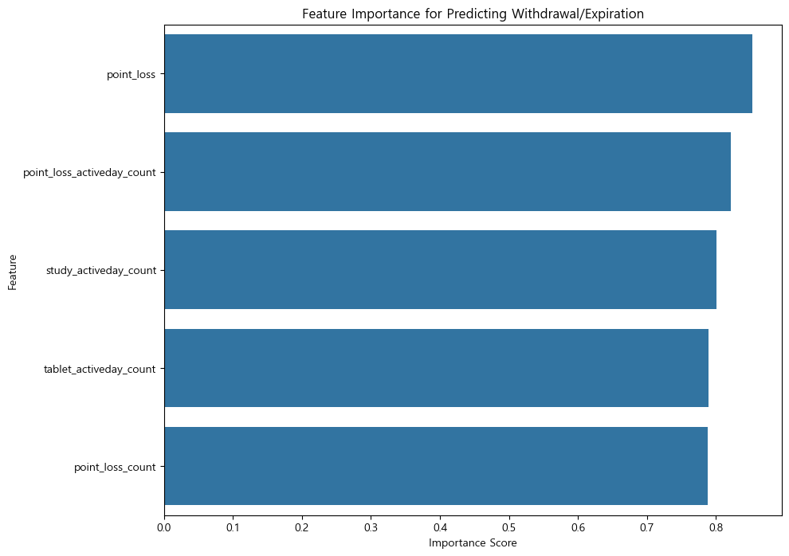
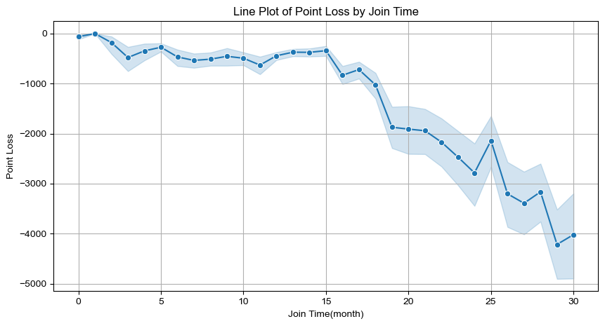

# 머신러닝 모델 성능 평가 보고서 - 정승연
---

**목차**

- [주제](#주제)
- [요약](#요약)
- [서론](#서론)
  - [문제 정의](#문제-정의)
  - [개발 환경](#개발-환경)
- [본문](#본문)
  - [기능 구현](#기능-구현)
    - [데이터 분석 및 전처리](#데이터-분석-및-전처리)
    - [생존율 분석](#생존율-분석)
    - [모델 학습 및 평가](#모델-학습-및-평가)
- [산출물](#산출물)
- [개선점](#개선점)

---

## 주제

- 머신러닝 모델을 활용하여 만료 및 탈퇴 회원에 대해 예측하기

## 요약

- 본 보고서는 가입일수와 포인트 손실을 고려하여 만료 및 탈퇴 회원을 예측하는 모델을 개발한 과정과 결과를 설명합니다. 가입일수와 포인트 손실이 회원의 생존율에 미치는 영향을 분석하고, 로지스틱 회귀 모델을 통해 만료 및 탈퇴 예측을 수행했습니다. 생존율 분석을 통해 초반에는 탈퇴 회원의 비율이 더 높으나 1년 이후에는 만료로 인한 회원 감소가 더 큰 것을 확인하였고 회원권이 연 단위로 설정되어 있는 것으로 추정하였습니다. 피처 중요도 분석 결과 가장 영향이 높았던 포인트 차감과 연관지어 1년 이내의 회원에 대하여 포인트 지급 프로모션을 진행하여 탈퇴를 방지하고, 그 이후에는 만료예정회원들의 회원권 갱신을 촉구할 필요가 있습니다. 이 보고서의 가장 큰 문제점은 클래스 불균형으로, 이로 인해 과적합된 결과로 예측됩니다. 만료 회원의 수가 샘플의 대다수를 차지하여 모델이 탈퇴 회원에 대해 예측하지 못하고 있습니다. 따라서 클래스 간 샘플 수를 균형 맞추는 작업이 필요하며 가중치 및 하이퍼파라미터 조절과 클래스 불균형에 더 민감한 지표를 활용하는 방법을 통해 모델 성능을 향상시킬 필요가 있습니다.

## 서론

### 문제 정의

- 회원 관리 시스템에서 만료와 탈퇴는 중요한 문제입니다. 고객의 만료와 탈퇴 시점, 그에 미치는 요인을 파악하여 조기에 만료 및 탈퇴를 예측하고 적절하게 대응함으로써 고객 유지도를 향상시킬 수 있습니다.
- 본 보고서는 `statusgroup_10_count`, `statusgroup_20_count`, `statusgroup_30_count` 컬럼을 회원 가입 기간으로 파악하여 이와 포인트 손실 데이터를 활용하여 만료 및 탈퇴 회원의 생존율을 분석하고 로지스틱 회귀 모델을 통해 예측하였습니다. 이러한 예측을 통해 고객 유지 전략을 개선하는 것이 목표입니다.

### 개발 환경

- 파이썬 버전: python 3.12.4
- 사용된 패키지 및 라이브러리

  | 패키지       | 버전   |
  | ------------ | ------ |
  | pandas       | 2.2.2  |
  | numpy        | 1.26.4 |
  | matplotlib   | 3.8.4  |
  | seaborn      | 0.13.2 |
  | scikit-learn | 1.3.0  |
  | sksurv       | 0.22.2 |

- 라이선스 정보
  - pandas: BSD License
  - numpy: BSD License
  - matplotlib: Matplotlib License
  - seaborn: BSD License
  - scikit-learn: BSD License
  - sksurv: BSD License

## 본문

### 기능 구현

#### 데이터 분석 및 전처리

1. 데이터 정보

- 데이터 설명

  - 111851개의 샘플과 54개의 특성으로 이루어져 있습니다.
  - 48개의 연속형 데이터 컬럼과 6개의 범주형 데이터 컬럼으로 나누어져 있습니다.
  - 남성 회원 수가 62615명이며 여성 회원 수가 46585명으로 남성 회원 수가 16030명 더 많습니다.
  - 초등학생 회원의 비율이 82.15%로 가장 높았습니다.

- 주요 컬럼

  - statusgroup_10_count: 임시회원 일수
  - statusgroup_20_count: 무료회원 일수
  - statusgroup_30_count: 유료회원 일수
  - point_loss: 차감 포인트
  - point_loss_activeday_count: 포인트 차감 일수
  - pount_loss_count: 포인트 차감 횟수

2. 데이터 전처리

- 결측치 처리

  - 전체 데이터에서 결측치가 너무 많은 경우에는 분석에 큰 영향을 미칠 것으로 판단하여 결측치의 비율이 90% 이상인 열들을 제거하였습니다.
  - 그 외의 결측치의 경우 앞서 제거하였던 열들을 제외하고 만료 혹은 탈퇴에 영향을 미치는 요인의 중요도를 판단할 때 결측치가 존재하는 행을 제거하는 방향이 효과적이라고 판단하여 결측치가 있는 행들을 제거하였습니다.

- 컬럼 생성

  - 임시회원, 무료회원, 유료회원의 일수(`statusgroup_10_count`, `statusgroup_20_count`, `statusgroup_30_count`)가 곧 회원으로 활동한 일수로 보아 `join_time` 이라는 새로운 컬럼에 세 컬럼의 합계를 저장하였습니다.

#### 생존율 분석

- 가입 일수 컬럼을 생성한 후 탈퇴와 만료 상태를 각각 나누어 넘파이 배열로 저장하여 Kaplan_meier_estimator를 활용하여 생존율을 분석하였습니다.

  

  - 개월수가 증가함에 따라 탈퇴회원의 생존율이 만료회원의 생존율보다 낮은 상태로 지속됩니다.
  - 대략 14개월을 기점으로 만료회원의 생존율이 탈퇴회원의 생존율보다 낮아지며 25개월에는 두 상태의 생존율이 동일하게 0으로 수렴합니다.

- 어떠한 요인이 회원 상태 변화에 영향을 미치는지를 파악하기 위해 피처 중요도를 계산한 후 상위 5개의 중요도를 확인했습니다.

  

  - 포인트 손실과 관련된 피처들이 가장 영향을 크게 미치는 요인입니다.

- 포인트 손실 관련 컬럼들만 추출하여 가입기간과의 상관관계를 라인플롯으로 시각화하였습니다.

  

  - 15개월을 기점으로 포인트 차감이 급격히 증가하였습니다.

#### 모델 학습 및 평가

- 모델을 만들기 위해서 데이터 전처리가 완료된 데이터셋(`member_df_cleaned`)에서 `memberstatus_codename`에서 `학습생(만료)`, `학습생(탈퇴)`인 데이터들만을 선별하여 새로운 데이터셋(`filtered_data`)으로 저장하였습니다. `memberstatus_codename`에는 `학습생(중지)` 데이터도 존재하였지만, 중지된 학생의 경우 미납으로 인한 중지로 판단하여 만료되거나 탈퇴된 학생만 중점적으로 살피기 위해 제외하였습니다.
- X 입력 데이터로는 `filtered_data`에서 포인트 손실 관련 컬럼이었던 `point_loss`, `point_loss_activeday_count`, `point_loss_count` 컬럼만 선별하였습니다.
- 새로운 데이터셋에서 `학습생(탈퇴)`를 1로, `학습생(만료)`를 0으로 두고 이를 `target`이라는 새로운 컬럼으로 저장하여 이를 y 타겟 데이터로 삼았습니다.
- y 데이터의 클래스별 수를 살펴보면, 0클래스(만료)가 26809명이며 1클래스(탈퇴)가 11명이었습니다.
- 포인트 손실이 가장 큰 영향을 미친다는 결과를 바탕으로 포인트 차감에 따른 회원 이탈 여부에 대한 예측을 하기 위해 로지스틱 회귀를 선택하였습니다.
- 평가지표로는 RMSE와 정확도, classification report를 사용하였습니다.

  - RMSE: 0.019
  - 정확도: 99%
  - classification report

    | 클래스 | Precision | Recall | F1-Score | Support |
    | ------ | --------- | ------ | -------- | ------- |
    | 만료   | 1.00      | 1.00   | 1.00     | 8043    |
    | 탈퇴   | 0.00      | 0.00   | 0.00     | 3       |

    | 지표                     | 값   |
    | ------------------------ | ---- |
    | Accuracy                 | 1.00 |
    | Macro Avg - Precision    | 0.50 |
    | Macro Avg - Recall       | 0.50 |
    | Macro Avg - F1-Score     | 0.50 |
    | Weighted Avg - Precision | 1.00 |
    | Weighted Avg - Recall    | 1.00 |
    | Weighted Avg - F1-Score  | 1.00 |

## 산출물

- 생존율 분석을 통해 초반에는 탈퇴 회원의 비율이 더 높으나 1년 이후에는 만료로 인한 회원 감소가 더 큰 것을 확인하였습니다. 1년 후에 만료에 의한 회원 감소가 증가하는 원인으로는 회원권이 연 단위로 설정되어 있는 것으로 추정됩니다. 특히 가장 초반 몇 개월에 탈퇴 회원에 대한 생존율 급감이 확연히 드러납니다. 이에 대응하여 회원가입 초기 고객 대상으로 한 이벤트와 1년 이내의 회원 탈퇴를 방지하기 위한 방안이 필요합니다.

- 그 중 가장 영향이 높았던 포인트 차감을 고려하여 1년 이내의 회원에 대하여 포인트 지급 프로모션을 진행하여 탈퇴를 방지하고, 그 이후에는 만료를 앞두고 있는 회원들에 대하여 갱신을 촉구할 필요가 있어보입니다.

- 포인트 손실이 급격히 증가하는 것과 회원 만료의 기울기가 급격히 감소하는 것이 동일한 시점에서 나타난다고 분석할 수 있으므로 회원이 만료 전에 갱신을 하면 포인트를 재지급하는 방안을 생각해볼 수 있을 것입니다.

## 개선점

- 이 보고서의 문제점은 클래스 불균형입니다. 원 데이터셋의 탈퇴 회원 수 892명, 만료 회원 수 109892명이고, 모델 학습에 적용시킨 최종 데이터셋 역시 만료 회원 26809명, 탈퇴 회원 11명으로 만료 회원의 수가 샘플의 대다수를 차지하며, 이로 인해 모델이 탈퇴 회원에 대해 예측하지 못하고 있습니다.

- 이는 모델의 평가지표에서도 알 수 있듯이 대부분의 데이터를 만료 회원으로 예측하여 높은 정확도를 달성하고 있지만, 탈퇴 회원에 대한 정확도는 0으로 나타납니다. 클래스 불균형으로 인해 과대 평가된 결과로 예측됩니다.

- 이러한 문제점은 데이터 증강, 오버샘플링(예: SMOTE), 언더샘플링 등으로 클래스 간 샘플 수를 균형 맞추는 것으로 모델의 성능을 향상시켜 개선할 수 있습니다. 혹은 탈퇴 회원 데이터에 더 높은 가중치를 부여하여 모델이 더 잘 예측하도록 유도하거나 하이퍼파라미터를 조정하는 방법을 시도해볼 수 있습니다. 또한 AUC-ROC 곡선, PR 곡선 등 클래스 불균형에 더 민감한 지표를 활용하는 방법도 있습니다.

## 소스코드

- [깃허브 url](https://github.com/seongyon98/machine-learning/tree/715162e54f7a3b1f929c51562946e967ca4e1870/0822_practice)
