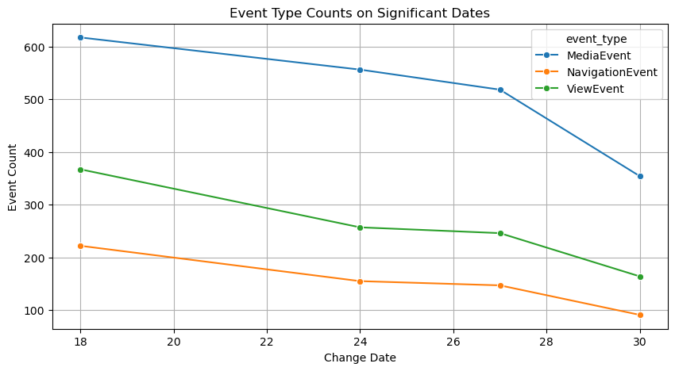
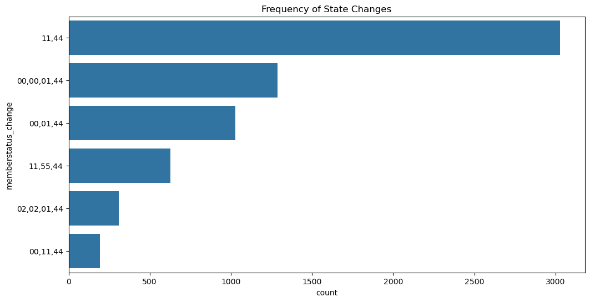
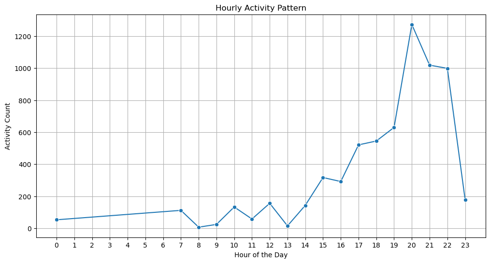
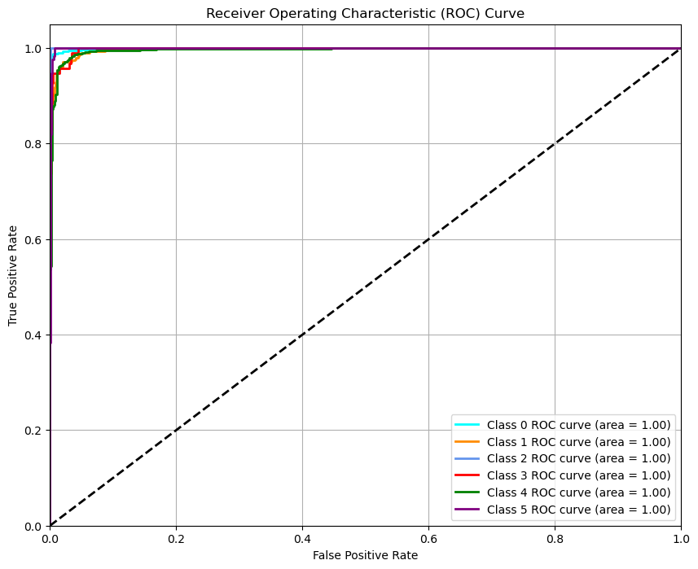
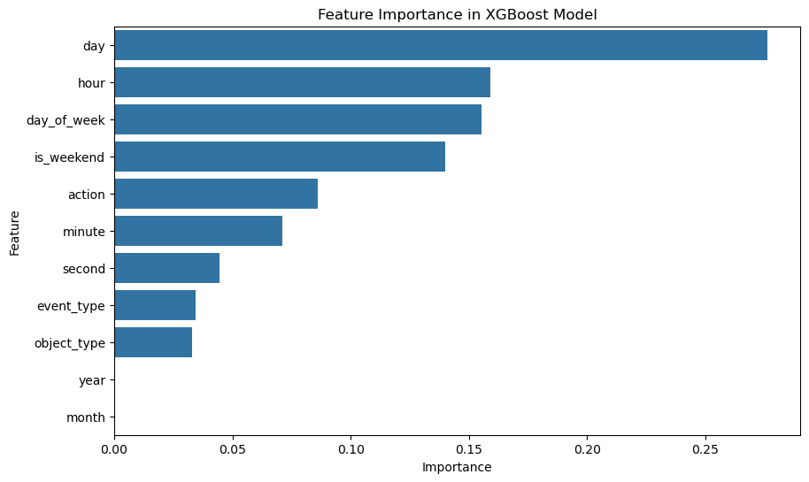

# 데이터 분석 및 모델링 보고서 - 정승연

---

**목차**

- [주제](#주제)
- [요약](#요약)
- [서론](#서론)
  - [문제 정의](#문제-정의)
  - [개발 환경](#개발-환경)
- [본문](#본문)
  - [기능 구현](#기능-구현)
    - [데이터 분석 및 전처리](#데이터-분석-및-전처리)
    - [모델 학습 및 평가](#모델-학습-및-평가)
- [산출물](#산출물)
- [개선점](#개선점)

---

## 주제

- 회원의 상태 변화에 대한 분석 및 예측 모델 개발

## 요약

- 본 보고서는 회원의 상태 변화(`memberstatus_change`)를 예측하기 위한 데이터 분석과 모델링 과정을 다룹니다. 프로젝트는 회원의 행동 데이터를 분석하여 상태 변화를 정확히 예측할 수 있는 모델을 구축하는 것을 목표로 했습니다. 회원 행동 분석을 통해 미디어 관련 이벤트(`MediaEvent`)가 가장 자주 발생한다는 점을 발견하였으며 시간대로는 오후 7시~11시 사이의 활동이 가장 빈번함을 알 수 있엇습니다. 회원의 행동 데이터를 통해 회원의 상태 변화를 예측하고자 `RandomForestClassifier`를 사용하여 모델을 학습시킨 결과, 이벤트 관련 컬럼만을 활용해 모델을 학습시켰을 때 모델 성능이 높지 않은 것을 확인하였습니다. 이에 추가로 시간 관련 피처(연도, 월, 일, 시간 등)를 포함하고, `XGBoost` 모델을 활용하여 성능을 개선했습니다. 테스트 데이터에서 약 96%의 정확도를 보였으며, ROC AUC 점수 역시 상승하여 모델의 성능이 개선되었음을 확인하였습니다. 피처 중요도 분석에서는 시간 관련 피처가 높은 중요도를 기록하였고, 이는 유저 행동 예측에 있어 시간적 요인이 더 중요한 역할을 한다는 것을 시사합니다. 다만 현재 모델의 성능이 학습 데이터에서보다 테스트 데이터에서 낮게 측정되는데, 이는 클래스 간 샘플 수의 불균형으로 인한 문제로 판단됩니다. 이러한 문제점 해결을 위해 클래스 가중치 조정, 합성 데이터 생성 등으로 클래스 간 샘플 수의 균형을 확보하고, 하이퍼파라미터를 조정하여 모델의 복잡도를 조정할 필요가 있습니다. 이와 더불어 시간 피처의 중요도가 높다는 점에서 특정 요일에서의 회원 활동 패턴의 변화 양상을 살펴보고, 시간 피처와 이벤트 피처의 상관관계를 파악하여 구체적인 분석을 진행할 수 있습니다.

## 서론

### 문제 정의

- 본 보고서는 회원의 행동 패턴을 이해하고 이를 기반으로 상태 변화를 예측하는 것을 목표로 합니다.회원의 상태 변화 예측은 회원의 상태가 변화할 때 이에 대한 적절한 대응 전략을 수립하는 데에 중요한 역할을 합니다. 회원의 행동에 대한 대응책 파악은 회원의 컨텐츠 이용빈도와 이용량을 개선하고 장기적으로 콘텐츠를 활용하게끔 유도하는 데에 도움을 줄 수 있습니다. 회원 상태 변화를 조기에 예측하여 특정 행동을 취할 가능성이 높은 회원에게 맞춤형 콘텐츠를 제공함으로써 회원의 이탈을 방지하고, 참여도를 향상시킬 수 있습니다.

### 개발 환경

- 파이썬 버전: python 3.12.4
- 사용된 패키지 및 라이브러리

  | 패키지       | 버전   |
  | ------------ | ------ |
  | pandas       | 2.2.2  |
  | numpy        | 1.26.4 |
  | matplotlib   | 3.8.4  |
  | seaborn      | 0.13.2 |
  | scikit-learn | 1.3.0  |
  | XGBoost      | 2.1.1  |

  - 라이브러리: itertools

- 라이선스 정보
  - pandas: BSD License
  - numpy: BSD License
  - matplotlib: Matplotlib License
  - seaborn: BSD License
  - scikit-learn: BSD License
  - XGBoost: Apache License 2.0

## 본문

### 기능 구현

#### 데이터 분석 및 전처리

1. 데이터 정보

- 데이터 설명

  - 6476개의 샘플과 44개의 특성으로 이루어져 있습니다.
  - 25개의 연속형 데이터 컬럼과 19개의 범주형 데이터 컬럼으로 나누어져 있습니다.
  - 남성 회원 수가 4615명이며 여성 회원 수가 1555명으로 남성 회원 수가 3060명 더 많습니다.
  - `grade`가 5인 회원들로만 구성되어 있습니다.

- 주요 컬럼

  - action: 회원 행동
  - event_type: 행동 이벤트의 타입
  - object_type: 활용한 매체의 타입
  - timestamp: 해당 행동을 수행한 시간
  - change_date: 회원 상태 변화 날짜

2. 유저 행동 초기 분석

- 유저 변화가 일어나는 날짜를 확인하였습니다.

  | change_date | MediaEvent | NavigationEvent | ViewEvent |
  | ----------- | ---------- | --------------- | --------- |
  | 18          | 617        | 222             | 367       |
  | 24          | 556        | 155             | 257       |
  | 27          | 518        | 147             | 246       |
  | 30          | 354        | 91              | 164       |

  - 변화가 빈번했던 날짜는 18일(1206건), 24일(968건), 27일(911건) 순으로 높았으며, 이 날짜들과 마지막날이었던 30일을 선정하여 이벤트 타입별로 그룹화하여 그 변화 양상을 확인하였습니다.

  

  - 모든 날짜에서 MediaEvent가 가장 높은 빈도로 발생하고 있으며, 다른 이벤트 타입에 비해 NavigationEvent의 발생 빈도가 낮습니다. ViewEvent는 변화 날짜마다 일정하게 발생하고 있습니다.
  - 18일에 가장 많은 이벤트가 발생하였으며 그 후로 발생 빈도가 감소하는 패턴을 보입니다.

- 회원 상태 변화 컬럼의 빈도수를 확인하였습니다.

  

  - 11-44 상태로 변화하는 경우가 가장 많으며, 00-11-44로 변화하는 경우가 가장 적습니다.

3. 유저 행동 재분석

- 초기 모델을 개선하기 위해 `timestamp` 피처를 추가하기로 결정하여 각 시간대별로 활동의 빈도수를 확인하였습니다.

  

  - 오후 1시부터 활동량이 증가하는 추세이며 오후 7시 이후에 급증하여 21시~23시 사이에 감소합니다.

4. 피처 엔지니어링

- 데이터 내용 변환

  - 회원 상태 변화(`memberstatus_change`) 중 `-`로 나타나는 부분은 모델 학습 시 인식이 되지 않는 문제를 발생시켰기 때문에 맨 앞에 `-`가 존재하는 경우에는 그 다음 상태값으로, 중간에 존재하는 경우에는 그 이전 상태값으로 대체하였습니다.
  - 시간(`timestamp`)컬럼을 datetime 객체로 변환한 후 모델 학습에 활용할 피처들을 추출하였습니다.
    - `year`, `month`, `day`, `hour`, `minute`, `second`, `day_of_week`, `is_weekend` 피처를 추출하였습니다.

#### 모델 학습 및 평가

1. 이벤트 관련 컬럼 모델

- X 입력 데이터로는 `event_type`, `action`, `object_type` 컬럼을 선별하였습니다.
- y 타겟 데이터로는 `memeberstatus_change`를 두었습니다.
- y 데이터의 클래스별 수를 살펴보면, 0클래스 1289명, 1클래스 1026명, 2클래스 192명, 3클래스 311명, 4클래스 3029명, 5클래스 629명으로, 4클래스의 수가 제일 많은 샘플 수를 가지고 있으며, 2클래스의 샘플 수가 가장 적었습니다.
  - 이는 위의 빈도수 그래프와 비교해보면 0 클래스가 00-00-01-44, 1클래스가 00-01-44, 2클래스가 00-11-44, 3클래스는 02-02-01-44, 4클래스는 11-44, 5클래스가 11-55-44의 상태 변화임을 알 수 있습니다.
- 하이퍼 파라미터 조정을 위해 그리드 서치를 진행하였고 그 결과 가장 최적의 파라미터 조건을 사용하였습니다. 사용한 파라미터는 다음과 같습니다.

  - 'min_samples_leaf': 2
    - 리프 노드에서 최소한으로 필요한 샘플 수
  - 'min_samples_split': 2
    - 노드 분할에 필요한 최소 샘플 수
  - 'n_estimators': 200
    - 모델에서 사용할 결정 트리의 개수

- 랜덤포레스트 분류기 모델을 통해 학습을 진행하였고 평가지표로는 cv scores, classification report, 정확도, roc_auc_score를 사용하였습니다.

  - mean cv_score : 0.47
  - 학습 데이터 정확도: 0.49
  - 테스트 데이터 정확도: 0.49
  - roc_auc_score: 0.64
  - classification report

    | class | precision | recall | f1-score | support |
    | ----- | --------- | ------ | -------- | ------- |
    | 0     | 0.00      | 0.00   | 0.00     | 403     |
    | 1     | 0.33      | 0.39   | 0.36     | 305     |
    | 2     | 0.00      | 0.00   | 0.00     | 59      |
    | 3     | 0.00      | 0.00   | 0.00     | 95      |
    | 4     | 0.52      | 0.91   | 0.66     | 909     |
    | 5     | 0.00      | 0.00   | 0.00     | 172     |

    | Metric           | precision | recall | f1-score | support |
    | ---------------- | --------- | ------ | -------- | ------- |
    | **accuracy**     |           |        | 0.49     | 1943    |
    | **macro avg**    | 0.14      | 0.22   | 0.17     | 1943    |
    | **weighted avg** | 0.30      | 0.49   | 0.37     | 1943    |

    - 4클래스의 재현율 이외에 다른 클래스들의 정밀도와 재현율, f1-score이 모두 낮아 전체적인 성능이 낮게 평가되는 것을 알 수 있습니다.

  - 피처 중요도
    | Feature | Importance |
    |--------------|------------|
    | action | 0.821968 |
    | object_type | 0.130216 |
    | event_type | 0.047816 |

    - `action` 피처의 중요도가 82%의 영향을 미치고 있습니다.

- 학습 데이터와 테스트 데이터의 정확도가 비슷하지만, 전체적으로 평가지표가 낮기 때문에 새로운 피처(시간)를 X에 추가하기로 결정하였습니다.

2. 시간 및 이벤트 컬럼 모델

- X 입력 데이터로는 `event_type`, `action`, `object_type` 컬럼 외에 `timestamp` 컬럼에서 추출하였던 `year`, `month`, `day`, `hour`, `minute`, `second`, `day_of_week`, `is_weekend`을 추가하였습니다.
- y 타겟 데이터로는 동일하게 `memeberstatus_change`를 두었습니다.

- 하이퍼 파라미터 조정을 위해 그리드 서치를 진행하였고 그 결과 가장 최적의 파라미터 조건을 사용하였습니다. 사용한 파라미터는 다음과 같습니다.

  - 'colsample_bytree': 0.8
    - 각 트리를 학습할 때 사용할 특성의 비율
  - 'learning_rate': 0.1
    - 학습률
  - 'max_depth': 10
    - 각 트리의 최대 깊이
  - 'n_estimators': 200
    - 모델에서 사용할 트리의 개수
  - 'subsample': 1.0
    - 각 트리를 학습할 때 사용할 데이터 샘플의 비율

- XGBoost 모델을 통해 학습을 진행하였고 평가지표로는 cv_score, classification report, 정확도, roc_auc_score를 사용하였습니다.

  - mean cv score: 0.52
  - 학습 데이터 정확도: 1.0
  - 테스트 데이터 정확도: 0.96
  - roc_auc_score: 0.99

    - 각 클래스별 roc 곡선을 확인하였습니다.

      

      - 클래스 간 비슷한 양상을 보이며, 0클래스와 2클래스, 5클래스가 가장 높은 점수를 보입니다.

  - classification report

    | class | precision | recall | f1-score | support |
    | ----- | --------- | ------ | -------- | ------- |
    | 0     | 0.98      | 0.99   | 0.98     | 403     |
    | 1     | 0.95      | 0.92   | 0.93     | 305     |
    | 2     | 0.97      | 0.98   | 0.97     | 59      |
    | 3     | 0.95      | 0.84   | 0.89     | 95      |
    | 4     | 0.96      | 0.98   | 0.97     | 909     |
    | 5     | 0.94      | 0.98   | 0.96     | 172     |

    | Metric           | precision | recall | f1-score | support |
    | ---------------- | --------- | ------ | -------- | ------- |
    | **accuracy**     |           |        | 0.96     | 1943    |
    | **macro avg**    | 0.96      | 0.95   | 0.95     | 1943    |
    | **weighted avg** | 0.96      | 0.96   | 0.96     | 1943    |

    - 앞선 모델보다 거의 모든 클래스의 정밀도와 재현율, f1-score, 전체적인 정확도가 90%를 넘기면서 모델의 성능이 개선되었음을 알 수 있습니다.

  - 피처 중요도

    

    - `day` 피처의 중요도가 가장 높았으며 시간 관련 피처들이 중요도가 높은 곳에 주로 분포하고 있습니다. 이벤트 관련 컬럼 중에서는 `action` 피처의 중요도가 높았습니다.

## 산출물

- 회원의 이벤트 타입별 활동 데이터와 상태 변화를 확인하였을 때 MediaEvent의 빈도수가 가장 높은 것은 회원들이 변화 시점에서 미디어와 관련된 행동을 많이 취하고 있음을 시사합니다. 미디어 콘텐츠에 대한 회원의 관심이 높으며, 변화가 감지될 때 미디어와의 상호작용이 증가할 가능성이 있다고 판단할 수 있습니다. 다른 이벤트 타입에 비해 NavigationEvent의 발생 빈도가 낮은 것은 회원들이 주로 특정 페이지나 콘텐츠를 탐색하기보다는 미디어를 소비하거나 특정 콘텐츠를 조회(View)하는 데 더 집중하고 있음을 나타냅니다. ViewEvent가 일정하게 발생하는 것은 회원들이 특정 콘텐츠를 조회하는 행동을 지속적으로 하고 있음을 보여줍니다.

- 회원들이 오후 시간에 활동하는 경우가 많으며, 특히 저녁시간대 즉 오후 7시~11시 사이에 가장 활발하게 행동한다는 사실을 알 수 있었습니다. 모델 학습을 통해 회원의 상태 변화에는 회원의 행동보다 시간이 더 큰 영향을 미치는 것을 확인하였을 때 학생을 대상으로 한 데이터라는 것을 고려하여 학교가 끝난 시간대에 더 많은 활동을 한다고 파악할 수 있습니다. 또한 시간 피처의 경우 시간과 분, 요일, 날짜 등 구체적이고 다양한 정보를 제공하기 때문에 더 큰 영향을 미친 것으로 판단됩니다.

## 개선점

- 현재 모델의 성능이 학습 데이터에서는 높지만 테스트 데이터에서는 낮은 이유 중 하나는 데이터의 불균형 때문입니다. 특히 4클래스의 샘플 수가 많고, 2클래스의 샘플 수가 적어 모델이 클래스 불균형에 민감해질 수 있습니다. 불균형한 데이터로 인해 모델이 다수 클래스에 과적합될 가능성이 있습니다. 다수 클래스에 대한 샘플이 많기 때문에, 모델이 이 클래스의 패턴을 지나치게 학습하게 되고, 결과적으로 소수 클래스에 대한 일반화 성능이 저하됩니다.

- 이러한 문제점은 오버샘플링 및 언더샘플링, 클래스 가중치 조정, 합성 데이터 생성 등으로 클래스 간 샘플 수를 균형 맞추는 것으로 모델의 성능을 향상시켜 개선할 수 있습니다. 예를 들어, SMOTE(Synthetic Minority Over-sampling Technique)를 사용하여 소수 클래스의 샘플을 생성하여 모델이 불균형 데이터를 더 잘 처리하도록 할 수 있습니다. 이외에도 하이퍼파라미터를 조정함으로써 모델의 복잡도를 조정하는 것도 방법이 될 수 있습니다.

- 시간 피처의 중요도가 높다는 점에서 이를 기반으로 회원의 활동 패턴을 특정 요일에 대해서도 그 변화 양상을 살펴보고 시간 피처와 이벤트 피처의 상관관계를 분석하는 작업을 통해 보다 구체적인 분석이 가능할 것으로 예상됩니다.

## 소스코드

- [깃허브 url](https://github.com/seongyon98/machine-learning/tree/8f66b468f1183b384daee72b9a9ff5a4063e608a/0826_practice2)
