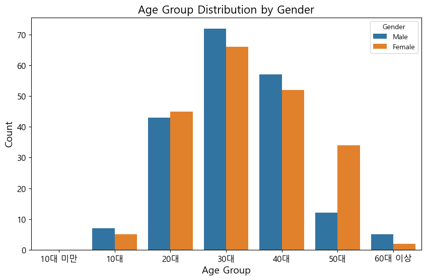
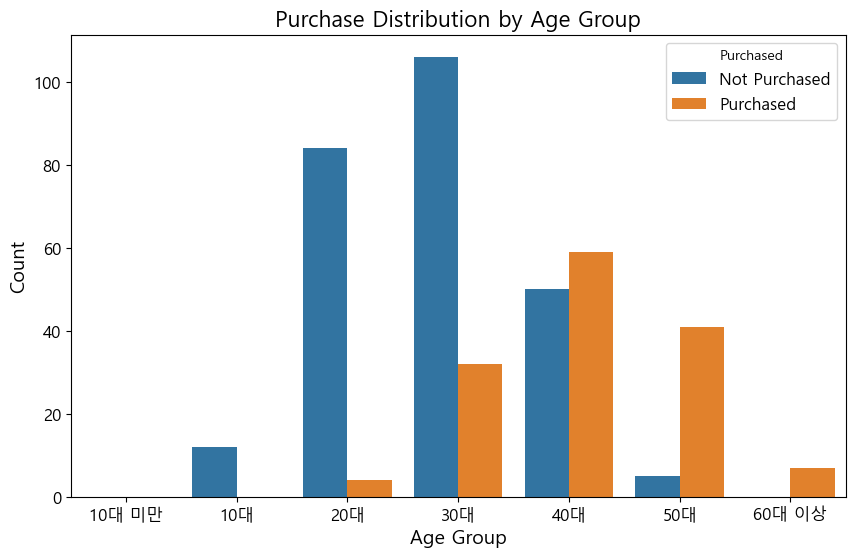
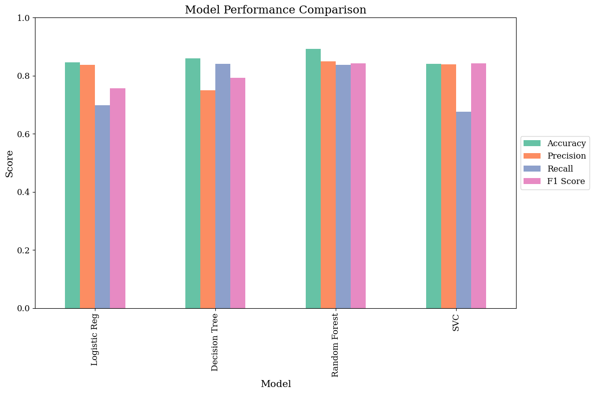

# 데이터 분석 및 모델링 보고서 - 정승연

---

**목차**

- [주제](#주제)
- [요약](#요약)
- [서론](#서론)

  - [문제 정의](#문제-정의)
  - [개발 환경](#개발-환경)

- [기능 구현](#기능-구현)
  - [데이터 분석 및 전처리](#데이터-분석-및-전처리)
  - [모델 학습 및 평가](#모델-학습-및-평가)
    - [분류 모델](#분류-모델)
    - [클러스터링](#클러스터링)
    - [회귀 모델](#회귀-모델)
- [산출물](#산출물)
- [개선점](#개선점)

---

## 주제

- 소셜 네트워크 광고 구매 전환에 대한 분석 및 모델 개발

## 요약

- 본 보고서는 소셜 네트워크 광고에 대한 구매 여부(`Purchased`)에 대한 데이터를 분석하고 모델링을 수행한 결과를 다룹니다. 분석 결과 60,000 달러~80,000 달러 사이의 급여를 받는 유저가 전체 400명 중 105명으로 가장 많았고, 30~40대의 유저가 247명으로 가장 많았고 이 분석결과는 전체 데이터 분포 15,000 달러~150,000 달러와 10대~60대 이상 중 중간에 위치하고 있습니다. 분류 모델 평가에서 랜덤 포레스트 모델이 0.85의 정밀도와 0.84의 재현율로 가장 우수한 성능을 보였고, 클러스터링 결과 클러스터 2(평균 급여 122,762 달러, 평균 나이 42세)가 80명 중 68명이 구매하여 가장 높은 구매 전환율(85%)을 기록했습니다. 회귀 모델 평가에서는 랜덤 포레스트 회귀 모델이 0.09의 MSE와 0.62의 R² score로 가장 높은 성능을 보였습니다. 이러한 분석을 바탕으로 각 연령대와 성별을 고려한 광고와 중간 수준의 급여 범위와 중장년층을 주요 타겟으로 삼아 차별화된 광고를 기획하는 전략을 통해 구매율을 높일 수 있을 것으로 생각됩니다. 회귀 모델들의 낮은 성능에 대해서 다른 모델을 활용하거나 앙상블 기법을 도입하는 것을 통해 개선을 시도해볼 수 있겠습니다.

## 서론

### 문제 정의

- SNS 유저의 연령대와 예측급여을 바탕으로 구매 여부를 확인하여 적합한 광고 전략을 세우는 것은 중요합니다. 비슷한 연령대, 예측급여의 유저의 그룹에 따라 차별화된 광고를 보여줌으로써 구매율을 개선할 수 있습니다.

### 개발 환경

- 파이썬 버전: python 3.12.4
- 사용된 패키지 및 라이브러리

  | 패키지       | 버전   |
  | ------------ | ------ |
  | pandas       | 2.2.2  |
  | numpy        | 1.26.4 |
  | matplotlib   | 3.8.4  |
  | seaborn      | 0.13.2 |
  | scikit-learn | 1.3.0  |
  | sciPy        | 1.14.1 |

- 라이선스 정보
  - pandas: BSD License
  - numpy: BSD License
  - matplotlib: Matplotlib License
  - seaborn: BSD License
  - scikit-learn: BSD License
  - sciPy: BSD License

## 기능 구현

### 데이터 분석 및 전처리

1. 데이터 정보

- 데이터 설명

  | Column          | Non-Null Count | Dtype  |
  | --------------- | -------------- | ------ |
  | Gender          | 400 non-null   | object |
  | Age             | 400 non-null   | int64  |
  | EstimatedSalary | 400 non-null   | int64  |
  | Purchased       | 400 non-null   | int64  |

- 여성 유저가 204명, 남성 유저가 196명으로 여성 유저가 8명 더 많습니다.
- 30대 회원이 138명으로 가장 많고 40대가 109명, 20대가 88명, 50대가 46명 순으로 많았고, 10대가 12명, 60대 이상이 7명, 10대 미만이 0명으로 가장 적었습니다.
- 평균 예측급여은 50대가 81,087 달러로 가장 높았고, 10대가 54,500 달러로 가장 낮았습니다.

- 성별에 따른 연령분포를 살펴보았습니다.

  

  - 10대와 30대, 40대, 60대 이상의 경우 각각 남자가 2명, 6명, 5명, 3명 더 많았고, 나머지 20대와 50대는 여자가 각각 2명, 22명 더 많았습니다. 성별 간 차이가 가장 큰 연령대는 50대였습니다.

- 연령대별 구매 여부를 살펴보았습니다.

  

  - 10대는 구매한 사람이 없었으며, 20대와 30대는 구매한 사람보다 구매하지 않은 사람이 각각 80명, 74명 더 많았습니다. 40대와 50대는 구매한 사람이 9명, 36명 더 많았고 60대 이상의 경우 7명 모두 구매하였습니다.

- 급여와 연령대에 대한 히스토그램 및 밀도곡선과 Q-Q plot을 그려보았습니다.

  

  - 급여 분포는 40,000 달러~100,000 달러 사이에 주로 분포되어 있으며, 특히 60,000 달러~80,000 달러 사이에 빈도가 높습니다. 밀도 곡선은 정규분포에 가깝지만 왼쪽 꼬리가 긴 형태로 출력되었습니다.
  - 연령은 주로 30세~50세 사이에 집중되어 밀도 곡선이 거의 정규분포를 따르고 있습니다.

  

  - 급여 데이터는 중간 구간에서는 정규분포와 일치하지만 하위와 상위 꼬리 부분에서 일치하지 않습니다. 25,000 달러 이하와 100,000 달러~150,000 달러 사이는 정규분포보다 낮게 분포되며 150,000 달러 이상은 정규분포보다 높게 분포되어 있습니다.
  - 연령 데이터는 대부분 정규분포와 일치하지만 20대 이하는 정규분포보다 낮고 50대 후반은 정규분포보다 높습니다.

2. 데이터 전처리

- 60대 이상 유저의 경우 sns 특성상 실제로 본인이 이용한다고 보기는 어렵다고 판단하여 삭제하였습니다.
- 10대의 급여가 1억 원 이상인 경우는 특이 케이스라고 판단하였고, 1,300원을 1달러로 계산하여 10대 중 77,000 달러 이상의 급여인 경우를 삭제하였습니다.

### 모델 학습 및 평가

- X 데이터로는 구매여부(`Purchased`)와 성별(`Gender`)를 제외한 연령(`Age`)과 예측급여(`EstimatedSalary`) 피처를 활용하였으며 타겟 데이터로는 구매 여부를 두었습니다. 이를 통해 연령과 급여에 따른 구매 여부를 판단하고자 하였습니다.

- 타겟 데이터에서 0 클래스(구매하지 않음)이 254명, 1클래스(구매함)이 136명입니다. 두 클래스 간의 차이가 2:1로 나지만 전체 데이터 수가 400개로 적기 때문에 그대로 진행하였습니다.

#### 분류 모델

- 모델은 로지스틱 회귀(`LogisticRegression`) 모델, 결정 트리(`DecisionTreeClassifier`) 모델, 랜덤 포레스트(`RandomForestClassifier`) 모델과 서포트 벡터 분류기(`SVC`)를 사용하였습니다.

- 정규화

  - 결정 트리 모델을 제외한 나머지 모델의 경우 `StandardScaler`로 정규화하였습니다.

- 하이퍼파라미터

  - 결정트리: max_depth(트리 최대 깊이)=3
  - 랜덤 포레스트: n_estimators(사용할 트리 개수)=10
  - svc: kernel(데이터를 고차원 공간으로 변환하는 함수)="linear"

- 교차검증을 하기 위해 StratifiedKFold를 적용하였습니다.

  - n_splits(데이터셋을 나눌 폴드의 수)=5
  - shuffle(데이터셋을 무작위로 섞을지 여부)=True

- 평가지표로는 정확도, 정밀도, 재현율, F1 score, 혼동표를 사용하였습니다.

  - 로지스틱 회귀 모델 혼동표
    | | Not Purchased | Purchased |
    |--------------------|---------------|-----------|
    | Not Purchased | 48 | 2 |
    | Purchased | 10 | 18 |

  - 결정 트리 모델 혼동표
    | | Not Purchased | Purchased |
    |--------------------|---------------|-----------|
    | Not Purchased | 46 | 4 |
    | Purchased | 7 | 21 |

  - 랜덤 포레스트 모델 혼동표
    | | Not Purchased | Purchased |
    |--------------------|---------------|-----------|
    | Not Purchased | 45 | 5 |
    | Purchased | 4 | 24 |

  - SVC 모델 혼동표
    | | Not Purchased | Purchased |
    |--------------------|---------------|-----------|
    | Not Purchased | 48 | 2 |
    | Purchased | 10 | 18 |

  | 모델                | Accuracy | Precision | Recall | F1 Score |
  | ------------------- | -------- | --------- | ------ | -------- |
  | Logistic Regression | 0.85     | 0.84      | 0.70   | 0.76     |
  | Decision Tree       | 0.86     | 0.75      | 0.84   | 0.79     |
  | Random Forest       | 0.89     | 0.85      | 0.84   | 0.84     |
  | SVC                 | 0.84     | 0.84      | 0.68   | 0.84     |

    

  - 정확도(`Accuracy`)는 랜덤포레스트 모델이 0.89로 가장 높게, SVC 모델이 0.84로 가장 낮게 나왔습니다. 정밀도(`Precision`)은 랜덤포레스트 모델이 0.85로 가장 높았으며 결정 트리 모델이 0.75로 가장 낮게 나왔습니다. 재현율(`Recall`)의 경우 SVC 모델이 0.68로 가장 낮게 나왔으며, F1 score에서는 로지스틱 회귀 모델이 0.76으로 가장 낮았습니다.

  - 로지스틱 회귀 모델은 구매로 예측한 경우에 실제로 구매한 확률, 즉 정밀도가 0.84로 높게 나왔습니다. 다만 실제로 구매한 경우에 대해서 구매한 것으로 예측한 확률인 재현율은 0.70으로 다소 낮게 나왔습니다. f1 score이 0.76로 정밀도와 재현율을 균형 있게 반영하였습니다.

  - 결정 트리 모델은 정밀도가 0.75로 낮게 평가되지만 재현율은 0.84로 높게 나왔습니다. f1 score 역시 0.79로 두 지표를 비교적 균형 있게 반영하고 있습니다. 정밀도가 낮아 `False Positives`를 많이 발생시킵니다.

  - 랜덤 포레스트 모델은 정밀도 0.85, 재현율 0.84로 모델이 구매 여부를 잘 예측하고 있습니다. 4개의 모델 중 가장 균형 잡힌 평가를 보입니다.

  - SVC 모델의 경우 정밀도는 0.84로 구매로 예측한 경우에 실제로 구매한 확률은 높지만 재현율이 0.68로 실제로 구매한 경우를 놓치는 경우가 상대적으로 많습니다.

- 가장 성능이 높게 나온 랜덤 포레스트 모델의 피처 중요도를 확인하였습니다.

  

  - 추정급여가 0.55, 나이가 0.45로 추정급여가 0.1 정도 더 높은 기여도를 보였습니다.

- 구매한 경우에 대해 랜텀 포레스트 모델의 SHAP 분석을 진행하였습니다.

  
  

  - 두 피처가 거의 동일한 기여도를 보이며 추정급여는 예측율을 높이고, 나이는 예측율을 낮추며 상쇄 작용을 통해 예측하고 있음을 알 수 있었습니다.

#### 클러스터링

- X 데이터로 예측급여와 연령을 활용하여 클러스터링을 진행하였습니다. X 데이터를 `StandardScaler`를 활용하여 정규화하였습니다.

- 엘보우 방법과 실루엣 다이어그램을 활용하여 최적의 클러스터 개수를 찾아보았습니다.

  
  

  - 엘보우 방법에서 기울기가 급격하게 줄어들면서 실루엣 다이어그램 상 클러스터마다 편차가 비슷하며 값이 충분히 존재하는 k 개수로 3을 설정하였습니다.

- `KMeans`로 클러스터링을 진행하였습니다.

  

  | Cluster | Estimated Salary Mean | Estimated Salary Median | Estimated Salary Std Dev | Age Mean | Age Median | Age Std Dev |
  | ------- | --------------------- | ----------------------- | ------------------------ | -------- | ---------- | ----------- |
  | 0       | 54943.75              | 57500.0                 | 23773.37                 | 28.34    | 28.0       | 5.22        |
  | 1       | 57166.67              | 59500.0                 | 20173.22                 | 44.59    | 42.0       | 6.32        |
  | 2       | 122762.50             | 122000.0                | 17069.66                 | 42.05    | 41.0       | 8.93        |

  - 클러스터 0 (파란색 점): 평균 급여는 54,943.75 달러로 세 클러스터 중 가장 낮습니다. 평균 나이는 28.34세로 가장 젊은 그룹입니다. 나이의 중앙값은 28세, 표준편차는 5.22로 적은 변동성을 보입니다.

  - 클러스터 1 (주황색 점): 평균 급여는 57,166.67 달러로 중간 정도에 위치하며 중앙값이 59,500 달러로 평균과 비슷합니다. 평균 나이는 44.59세이고 표준편차가 6.32로 약간의 변동성이 있습니다.

  - 클러스터 2 (초록색 점): 평균 급여가 122,762 달러로 가장 높으며 중앙값이 122,000 달러로 평균과 거의 일치합니다. 세 클러스터 중 표준편차가 17,069.66 달러로 가장 낮습니다. 평균 나이는 42.05세로 클러스터 1보다 조금 더 젊으며 표준편차가 9.93으로 가장 높아 변동성이 큰 편입니다.

- 각 클러스터와 구매 여부와의 연관성을 확인하였습니다.

  

  - 클러스터 0은 구매한 사람이 1명, 구매하지 않은 사람이 159명으로 집계되었습니다. 클러스터 1의 경우 구매하지 않은 사람이 83명, 구매한 사람이 67명으로 구매하지 않은 사람이 16명 더 많았습니다. 클러스터 2는 구매하지 않은 사람이 12명, 구매한 사람이 68명으로 구매한 사람이 56명 더 많았습니다.

#### 회귀 모델

- 모델은 서포트 벡터 회귀(`SVR`) 모델, 결정 트리 회귀(`DecisionTreeRegressor`) 모델, 랜덤 포레스트 회귀(`RandomForestRegressor`) 모델과 선형 회귀(`LinearRegression`) 모델을 사용하였습니다.

- 정규화

  - `StandardScaler`로 정규화하였습니다.

- 하이퍼파라미터

  - svr: kernel(데이터를 고차원 공간으로 변환하는 함수)="linear"
  - 랜덤 포레스트 회귀: n_estimators(사용할 트리 개수)=100

- 평가지표로는 MAE, MSE, RMSE, R² score을 사용하였습니다.

  | Model                           | MAE  | MSE  | RMSE | R² Score |
  | ------------------------------- | ---- | ---- | ---- | -------- |
  | SVR (Support Vector Regression) | 0.28 | 0.12 | 0.35 | 0.46     |
  | Decision Tree Regressor         | 0.16 | 0.16 | 0.40 | 0.32     |
  | Random Forest Regressor         | 0.16 | 0.09 | 0.30 | 0.62     |
  | Linear Regression               | 0.29 | 0.12 | 0.35 | 0.47     |

  

  - MAE(실제 값과 예측 값 간 절대 오차의 평균)는 결정 트리 회귀 모델과 랜덤 포레스트 모델이 0.16으로 가장 낮게 나왔으며, 선형 회귀 모델이 0.29로 가장 높았습니다.

  - MSE(실제 값과 예측 값 간 제곱 오차의 평균)는 랜덤 포레스트 회귀 모델이 0.09로 가장 낮게 나왔으며 결정 트리 회귀 모델이 0.16으로 가장 높게 나왔습니다.

  - RMSE(MSE의 제곱근) 역시 랜덤 포레스트 회귀 모델이 0.30으로 가장 낮았고, 결정 트리 회귀 모델이 0.40으로 가장 높았습니다.

  - R² score(데이터의 변동성을 잘 설명하는지)의 경우 랜덤 포레스트 회귀 모델이 0.62로 가장 높았으며 결정 트리 회귀 모데리 0.32로 가장 낮았습니다.

  - SVR 모델은 MAE와 RMSE가 다소 높아 예측 오차가 있지만 R² score이 0.46으로 절반 정도의 설명력을 보입니다.

  - 결정 트리 회귀 모델은 MAE는 0.16으로 예측 정확도가 좋지만, 나머지 오차 지표가 높고, R² score 역시 가장 낮아 설명력이 낮습니다.

  - 랜덤 포레스트 회귀 모델은 오차지표가 전체적으로 낮으며, R² score이 0.62로 상대적으로 설명력이 좋습니다.

  - 선형 회귀 모델은 SVR 모델과 성능이 비슷합니다.

- 랜덤 포레스트 모델의 성능이 가장 높게 나왔지만, R² score가 0.62에 그치는 것은 그 모델의 성능이 좋다고 판단하기는 어렵다고 생각하여 그리드 서치를 진행해보았습니다.

  - 하이퍼파라미터 조정

    - `n_estimators` (트리 개수): [50, 100, 200]
    - `max_depth` (트리 최대 깊이): [None, 10, 20, 30]
    - `min_samples_split` (노드 분할 시 최소 샘플 수): [2, 5, 10]
    - `min_samples_leaf` (리프 노드의 최소 샘플 수): [1, 2, 4]
    - `bootstrap` (부트스트랩 샘플링 사용 여부): [True, False]

    - 이 중 최적의 조합으로 나온 것을 활용하였습니다.
      - `bootstrap`: True
      - `max_depth`: None
      - `min_samples_leaf`: 4
      - `min_samples_split`: 2
      - `n_estimators`: 50

  - 모델 성능 평가

    - MAE: 0.16
    - MSE: 0.08
    - RMSE: 0.28
    - R² Score: 0.66

  - MSE가 0.01, RMSE가 0.02 줄어들고, R² score이 0.04 증가하였습니다. 그리드 서치를 통한 하이퍼파라미터 조정만으로는 눈에 띄는 모델 성능 개선을 확인할 수는 없었습니다.

- 가장 성능이 높게 나온 랜덤 포레스트 모델의 피처 중요도를 확인하였습니다.

  

  - 추정급여가 0.52, 나이가 0.48로 추정급여가 0.04 정도 더 높은 기여도를 보였습니다.

- 랜덤 포레스트 모델을 바탕으로 SHAP 분석을 진행하였습니다.

  
  

  - train set과 test set의 shap value 값을 비교해본 결과, 추정급여와 나이 피처가 두 데이터셋에서 모두 낮은 값에서는 부정적인 영향을, 높은 값에서는 긍정적인 영향을 끼친다는 것을 확인할 수 있었습니다.

## 산출물

- 각 연령대별 성별의 차이가 나는 것과 40대 이상에서의 구매 확률이 높은 것을 고려하여 각 연령대와 성별에 따른 맞춤형 광고 전략을 통해 구매율을 개선할 수 있습니다. 급여 분포에서 유저들이 60,000 달러~80,000 달러의 급여 수준이 가장 많다는 것과 연령 분포에서는 30~40대가 많다는 것을 확인하였습니다. 모델 성능 평가 결과 나이와 급여의 기여도가 비슷하게 나온 것을 알 수 있었습니다. 이를 바탕으로 중간 수준의 급여 범위와 중장년층을 주요 타겟으로 삼아 광고하는 방안을 생각해볼 수 있습니다.

- 분류 모델 중 가장 성능이 좋은 모델은 랜덤 포레스트 모델이었으며, 회귀 모델 중에서는 랜덤 포레스트 회귀 모델이 가장 성능이 좋게 나왔습니다. 클러스터링 결과 급여가 낮고 젊은 층(클러스터 0)은 구매 전환율이 낮으며, 평균 급여가 높고 평균 연령이 40대 초반인 그룹(클러스터 2)가 구매 전환율이 제일 높았습니다. 이를 고려하여 젊은 층과 중장년층 간의 광고 차별화를 둘 필요가 있습니다.

## 개선점

- 본 보고서에서 회귀 모델들은 비교적 낮은 성능을 보이고 있습니다. 이를 개선하기 위해 다른 모델을 활용하거나 앙상블 기법을 생각해볼 수 있습니다.

## 소스코드

- [깃허브 url](https://github.com/seongyon98/machine-learning/tree/main/0830~0902%20practice3)
